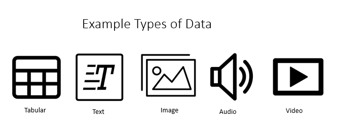

# Datasets & Dataloaders

## Getting Started With Data in PyTorch

Before we can even think about building a model with PyTorch, we need to first learn how to load and process data. Data comes in all sorts of forms and formats from structured tables, to image, audio, text, video files and more. 




Since different model architectures can be applied to many data types, we ideally want our dataset code to be decoupled from model training code. Different data types require different python libraries to load and process such as open cv and pil for images, nltk and spacy for text and librosa for audio. Data can be sourced from local files, cloud datastores and databases code. 

As such code for processing data can quickly get messy and become hard to maintain, if not properly organized. To this end PyTorch provides a simple Datasets interface for linking managing collections of data. 

A whole set of example datasets such as MNIST that implement this interface are built into PyTorch extension libraries. These are useful for benchmarking and testing your models before training on your own custom datasets.

 You can find some of them below. 
 - [Image Datasets](https://pytorch.org/docs/stable/torchvision/datasets.html)
 - [Text Datasets](https://pytorch.org/text/datasets.html)
 - [Audio Datasets](https://pytorch.org/audio/datasets.html)

 ## Iterating through a Dataset

Once we have a Dataset we can index it manually clothing[i]. 

Here is an example of how to load the fashion MNIST dataset from torch vision.


```python

import torch 
from torch.utils.data import Dataset
import torchvision.datasets as datasets
import matplotlib.pyplot as plt
import numpy as np

clothing = datasets.FashionMNIST('data', train=True, download=True)
labels_map = {0 : 'T-Shirt', 1 : 'Trouser', 2 : 'Pullover', 3 : 'Dress', 4 : 'Coat', 5 : 'Sandal', 6 : 'Shirt',
              7 : 'Sneaker', 8 : 'Bag', 9 : 'Ankle Boot'}
figure = plt.figure(figsize=(8,8))
cols, rows = 3, 3
for i in range(1, cols*rows +1):
    sample_idx = np.random.randint(len(clothing))
    img = clothing[sample_idx][0][0,:,:]
    figure.add_subplot(rows, cols, i)
    plt.title(labels_map[clothing[sample_idx][1]])
    plt.axis('off')
    plt.imshow(img, cmap='gray')
plt.show()
```


## Creating a Custom Dataset
To work with your own data lets look at the a simple custom image DataSet implementation:

```python
import os
import torch
import pandas as pd
from torch.utils.data import Dataset
from torchvision import transforms, utils
from torchvision.io import read_image

class CustomImageDataset(Dataset):
    """Custom Image PyTorch Dataset."""

    def __init__(self, annotations_file, img_dir, transform=None):
        """
        Args:
            annotations_file (string): Path to file containing image anntoations .
            img_dir (string): Directory with all the images.
            transform (callable, optional): Optional transform to be applied on a sample, see the next section for more information.
        """
        self.img_labels = pd.read_csv(annotations_file)
        self.img_dir = img_dir
        self.transform = transform

    def __len__(self):
        return len(self.img_labels)

    def __getitem__(self, idx):
        # Return a single transformed item of our dataset.
        # This is where the processing logic for reading our images goes
        if torch.is_tensor(idx):
            idx = idx.tolist()

        img_name = os.path.join(self.root_dir,
                                self.img_labels.iloc[idx, 0])
        image = read_image('path_to_image.jpeg')
        label = self.img_labels.iloc[idx, 1:]
        sample = {'image': image, 'label': label}

        if self.transform:
            sample = self.transform(sample)

        return sample 
        
```

## Lets break down whats happening in this sample implementaion of a PyTorch Dataset function by function.

## Imports 

Import os for file handling, torch for PyTorch, [pandas](https://pandas.pydata.org/) for loading labels, [torch vision](https://pytorch.org/blog/pytorch-1.7-released/) to read image files, and Dataset to implement the Dataset interface.

Example:
```python
import os
import torch
import pandas as pd
from torchvision.io import read_image
from torch.utils.data import Dataset
```

## Init

The init function is used for all the first time operations when our Dataset is loaded. In this case we use it to load our annotation labels to memory and the keep track of directory of our image file. Note that different types of data can take different init inputs you are not limited to just an annotations file, directory_path and transforms but for images this is a standard practice.

Example:

```python
 def __init__(self, annotations_file, img_dir, transform=None):
        """
        Args:
            annotations_file (string): Path to file containing image anntoations .
            img_dir (string): Directory with all the images.
            transform (callable, optional): Optional transform to be applied on a sample, see the next section for more information.
        """
        self.img_labels = pd.read_csv(annotations_file)
        self.img_dir = img_dir
        self.transform = transform
```

## __len__

The __len__ function is very simple here we just need to return the number of samples in our dataset. 

Example:
```python
    def __len__(self):
        return len(self.img_labels)
```

## __getitem__
The __getitem__ function is the most important function in the Datasets interface this. It takes a tensor or an index as input and returns a loaded sample from you dataset at from the given indecies.

In this sample if provided a tensor we convert the tensor to a list containing our index. We then load the file at the given index from our image directory as well as the image label from our pandas annotations DataFrame. This image and label are then wrapped in a single sample dictionary which we can apply a Transform on and return. To learn more about Transforms see the next section of the Blitz. 

Example:
```python
    def __getitem__(self, idx):
        # Return a single transformed item of our dataset.
        # This is where the processing logic for reading our images goes
        if torch.is_tensor(idx):
            idx = idx.tolist()

        img_name = os.path.join(self.root_dir,
                                self.img_labels.iloc[idx, 0])
        image = read_image('path_to_image.jpeg')
        label = self.img_labels.iloc[idx, 1:]
        sample = {'image': image, 'label': label}

        if self.transform:
            sample = self.transform(sample)

        return sample 
```

## Preparing your data for training with DataLoaders

Now we have a organized mechansim for managing data which is great but there is still a lot of manual work we would have to do train a model. 

For example if we wanted to train a model with our dataset we would have to manually maintain the code for 
- Data batching 
- Suffling data 
- Distributing sata across multiple parallel processes and GPUs

The PyTorch Dataloader ```torch.utils.data.DataLoader``` is an iterator that handles all of this complexity for us enabling us to load a dataset and train our model


```python

dataloader = DataLoader(clothing, batch_size=4,
                        shuffle=True, num_workers=0)

```

With this we have all we need to know to load an process data of any kind in PyTorch to train deep learning models.


## More help with the FashionMNIST Pytorch Blitz
[Tensors]()<br>
[DataSets and DataLoaders]()<br>
[Transformations]()<br>
[Choosing Model]()<br>
[Optimization Loop]()<br>
[AutoGrad]()<br>
[Back to FashionMNIST main code base]()<br>
