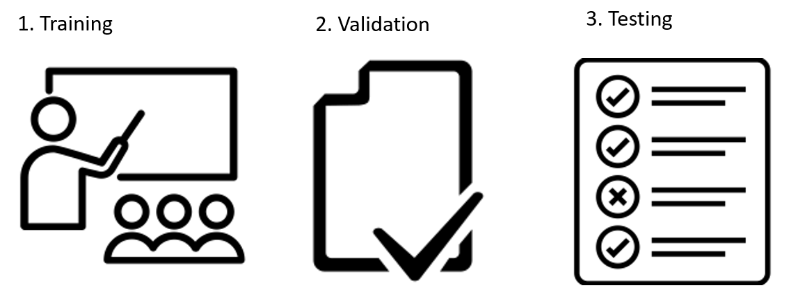

# Optimizing Model Parameters¶

Now that we have a model and data it's time to train, validate and test our model by optimizating it's paramerters on our data! 

To do this we need to understand a how to handle 5 core deep learning concepts in PyTorch
1. Hyperparameters (learning rates, batch sizes, epochs etc)
2. Optimization Loops
3. Loss
4. AutoGrad
5. Optimizers 

Let's dissect these concepts one by one and look at some code at the end we'll see how it all fits together.

## Hyperparameters 

Hyperparameters are adjustable parameters that let you control the model optimization process. 

For example, with neural networks, you can configure:

 - **Number of Epochs**- the number times iterate over the dataset to update model parameters
 - **Batch Size** - the number of samples in the dataset to evaluate before you update model parameters
 - **Cost Function** - the method used to decide how to evaluate the model on a data sample to update the model parameters
 - **Learning Rate** - how much to update models parameters at each batch/epoch set this to large and you won't update optimally if you set it to small you will learn really slowly 
 
```python
    learning_rate = 1e-3
    batch_size = 64
    epochs = 5
```

## Optimizaton Loops

Once we set our hyperparameters we can then train and optimize our model with optimization loop.

Each iteration of the optimziation loop is called an Epoch. Each epoch is comprized of three main subloops in PyTorch. 


 1. The Train Loop -  Core loop iterates over all batches
 2. The Validation Loop - Validate loss after each weight parameter update and can be used to gauge hyper parameter performance and update them for the next batch. 
 3. The Test Loop - is used to evaluate our models performance after each epoch on traditional metrics to show how much our model is generalizing from the train and validation dataset to the test dataset it's never seen before.  

 ```python
    for epoch in range(num_epochs): # Optimization Loop
        # Train loop over batches
            model.train() # set model to train 
            # Model Update Code
            model.eval() # After exiting batch loop set model to eval to speed up evaluation and not track gradients (this is explained below) 
            # Validation Loop
            # - Put sample validation metric logging and hyperparameter update code here 
        # After exiting train loop set model to eval to speed up evaluation and not track gradients (this is explained below) 
        # Test Loop
             # - Put sample test metric logging and hyperparameter update code here 
 ```

## Loss 
The loss is the value used to update our parameters. To calculate the loss we make a prediction using the inputs of our given data sample. 

```python
    preds = model(inputs)
    loss = cost_function(preds, labels)
```


Common loss functions include [Mean Square Error](https://pytorch.org/docs/stable/generated/torch.nn.MSELoss.html#torch.nn.MSELoss), [Negative Log Likelihood](https://pytorch.org/docs/stable/generated/torch.nn.NLLLoss.html#torch.nn.NLLLoss), and [CrossEntropyLoss](https://pytorch.org/docs/stable/generated/torch.nn.CrossEntropyLoss.html#torch.nn.CrossEntropyLoss). Here is an example built in Cross Entropy Loss cost function call from the PyTorch nn module.

```python
 cost_function = nn.CrossEntropyLoss()
 loss = cost_function(model_prediction, true_value)
```

In addition to the included PyTorch cost functions you can create your own custom cost functions as long as they are differentiable. 

See this example custom Cross Entropy Loss implementation from the [Stanford CS230](https://cs230.stanford.edu/blog/pytorch/#loss-function) course below

```python
 def myCrossEntropyLoss(outputs, labels):
    batch_size = outputs.size()[0]            # batch_size
    outputs = F.log_softmax(outputs, dim=1)   # compute the log of softmax values
    outputs = outputs[range(batch_size), labels] # pick the values corresponding to the labels
    return -torch.sum(outputs)/num_examples

```
It can then be called just like out of the box implementation above

```python
 loss = myCrossEntropyLoss(model_prediction, true_value)
```
A more in depth explanation of PyTorch cost functions is outside the scope of the blitz but you can learn more about the different common cost functions for deep learning in the PyTorch [documentation](https://pytorch.org/docs/stable/nn.html#loss-functions). 

## AutoGrad and Optimizer 

Using the loss we can then optimize our models parameters. By default each tensor maintains a graph of every operation applied on it unless otherwise specified using the torch.no_grad() command. 


PyTorch uses this graph to automatically update parameters with respect to our model's loss during training. This is done with one line loss.backwards(). Once we have our gradients the optimizer is used to propgate the gradients from the backwards command to update all the parameters in our model. 

```python
    optimizer.zero_grad() # make sure previous gradients are cleared
    loss.backward() # calculates gradients with respect to loss
    optimizer.step()
```

The standard method for optimization is called Stochastic Gradient Descent, to learn more check out this awesome video by [3blue1brown](https://www.youtube.com/playlist?list=PLZHQObOWTQDNU6R1_67000Dx_ZCJB-3pi). 

There are many different optimizers and variations of this method in PyTorch such as ADAM and RMSProp that work better for different kinds of models. 
They are outside the scope of this Blitz, but can check out the full list of optimizers[here](https://pytorch.org/docs/stable/optim.html) 

## Putting it all together lets look at a basic optimization loop

```python

#initilize optimizer and example cost function

# For loop to iterate over epoch
    # Train loop over batches 
        # Set model to train mode
        # Calculate loss using 
        # clear optimizer gradient
        # loss.backword
        # optimizer step
        # Set model to evaluate mode and start validation loop
        #calculate validation loss and update optimizer hyper parameters
    # Set model to evaluate test loop

```

Walk through key parts of code here 
